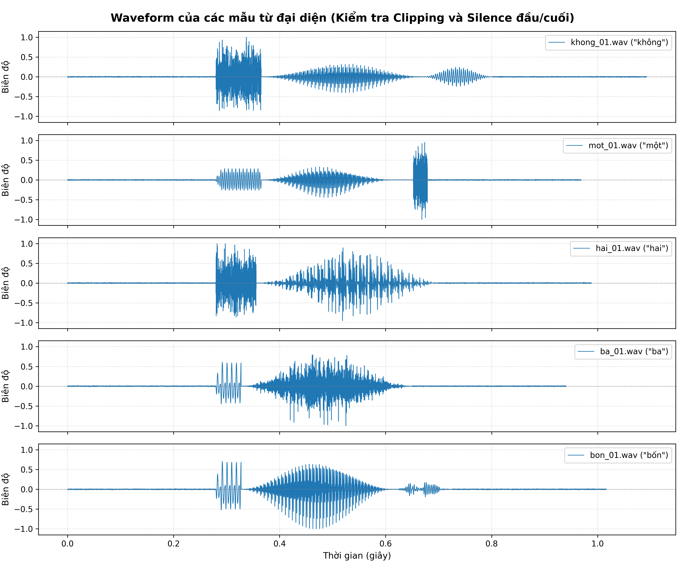
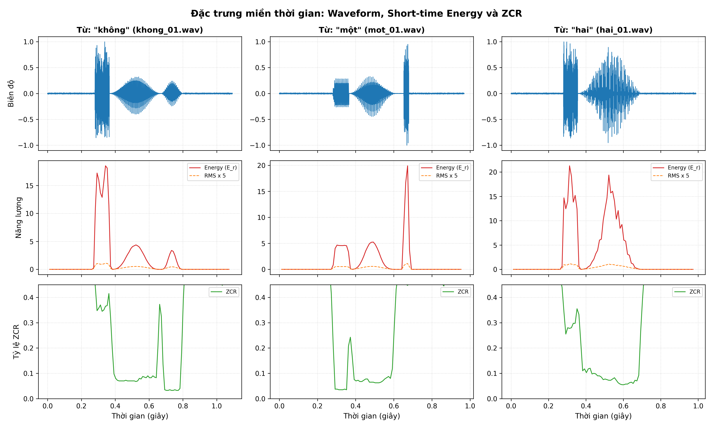
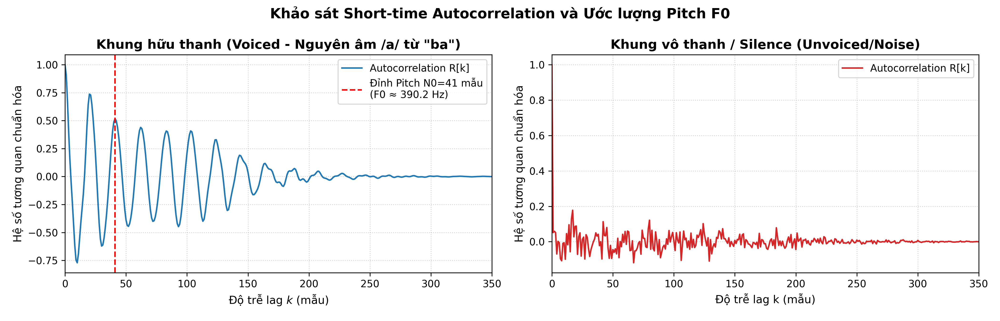
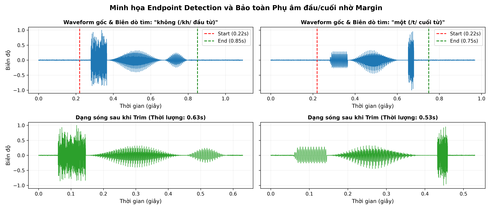
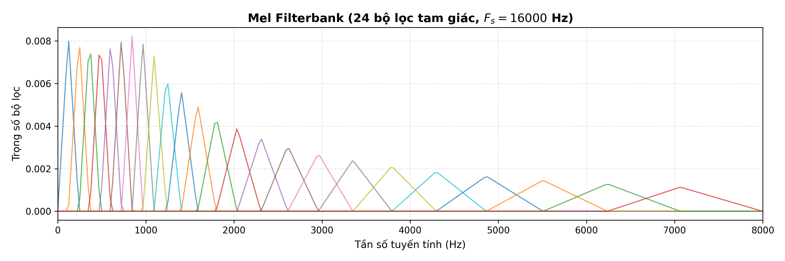
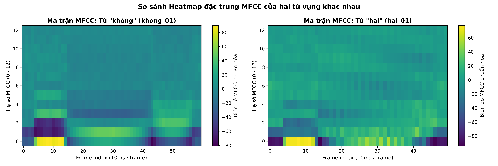
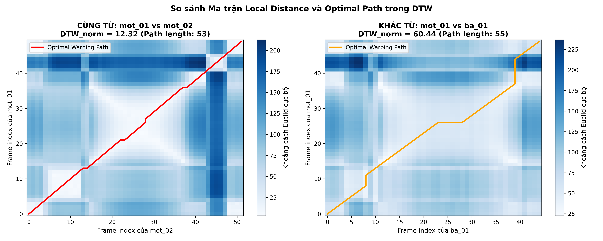
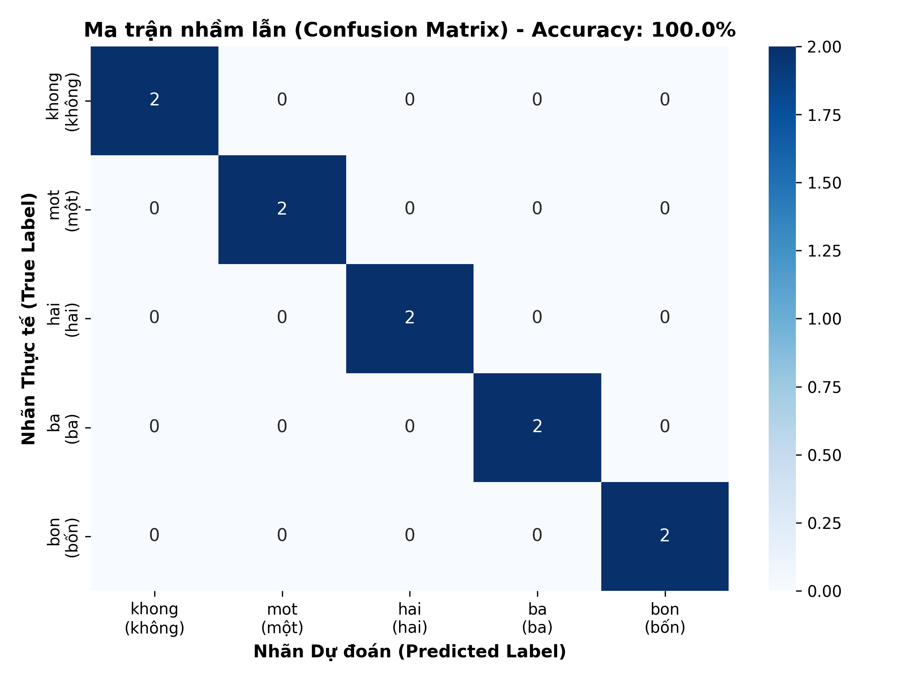
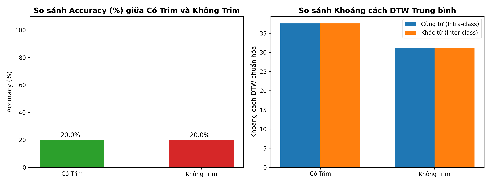
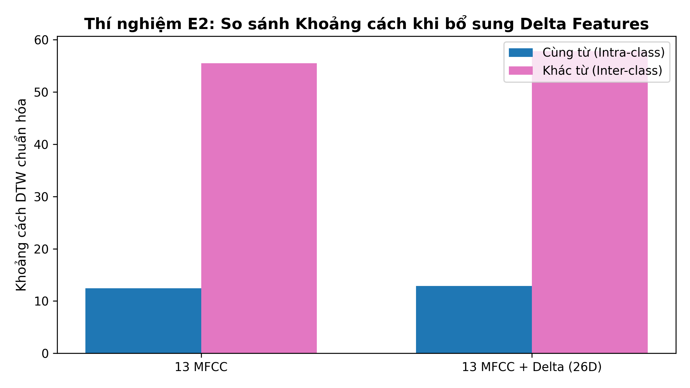

# TRƯỜNG ĐẠI HỌC THỦY LỢI
### KHOA CÔNG NGHỆ THÔNG TIN • BỘ MÔN TRÍ TUỆ NHÂN TẠO
---

<br>

# BÁO CÁO THỰC HÀNH BÀI TẬP SỐ 2 (LAB 2)
## HỌC PHẦN: CSE457 - XỬ LÝ ÂM THANH VÀ TIẾNG NÓI
### CHỦ ĐỀ: ĐẶC TRƯNG TIẾNG NÓI VÀ NHẬN DẠNG BẰNG DTW
*(Từ phân tích ngắn hạn đến MFCC, căn chỉnh thời gian động và nhận dạng từ đơn)*

<br>

**Thông tin sinh viên thực hiện:**
- **Họ và tên sinh viên:** Mai Thị Thu Hương
- **Mã số sinh viên (MSSV):** 2351260657
- **Lớp học phần:** 65TTNT (Ngành Trí tuệ Nhân tạo - Khoa CNTT)
- **Giảng viên hướng dẫn:** Bộ môn Trí tuệ Nhân tạo
- **Học kỳ / Năm học:** Học kỳ 2 - Năm học 2025–2026
- **Tệp mã nguồn đính kèm:** `Lab2_2351260657.ipynb`

---

## MỤC LỤC

1. [TỔNG QUAN VÀ MỤC TIÊU BÀI LAB](#1-tổng-quan-và-mục-tiêu-bài-lab)
2. [CẤU HÌNH THAM SỐ BASELINE VÀ KIẾN TRÚC PIPELINE](#2-cấu-hình-tham-số-baseline-và-kiến-trúc-pipeline)
3. [NỘI DUNG THỰC HÀNH CHI TIẾT (A $\to$ G)](#3-nội-dung-thực-hành-chi-tiết)
   - [Phần A: Thu thập dữ liệu và kiểm tra chất lượng](#phần-a-thu-thập-dữ-liệu-và-kiểm-tra-chất-lượng)
   - [Phần B: Đặc trưng miền thời gian (Energy, RMS, ZCR, Autocorrelation & Pitch)](#phần-b-đặc-trưng-miền-thời-gian)
   - [Phần C: Phát hiện điểm đầu - điểm cuối (Endpoint Detection / VAD)](#phần-c-phát-hiện-điểm-đầu---điểm-cuối)
   - [Phần D: Trích xuất đặc trưng MFCC (Mel-Frequency Cepstral Coefficients)](#phần-d-trích-xuất-đặc-trưng-mfcc)
   - [Phần E: Tự cài đặt Dynamic Time Warping (DTW)](#phần-e-tự-cài-đặt-dynamic-time-warping-dtw)
   - [Phần F: Xây dựng bộ nhận dạng Nearest-Template & Cơ chế Reject](#phần-f-xây-dựng-bộ-nhận-dạng-nearest-template)
   - [Phần G: Đánh giá mô hình & Các thí nghiệm mở rộng (E1, E2, E3)](#phần-g-đánh-giá-mô-hình--các-thí-nghiệm-mở-rộng)
4. [BẢNG TỔNG HỢP MA TRẬN KẾT QUẢ THEO YÊU CẦU ĐỀ BÀI](#4-bảng-tổng-hợp-ma-trận-kết-quả-chuẩn-mục-41)
5. [TRẢ LỜI CHI TIẾT 9 CÂU HỎI BÁO CÁO LÝ THUYẾT](#5-trả-lời-chi-tiết-9-câu-hỏi-báo-cáo-lý-thuyết)
6. [KẾT LUẬN VÀ TÀI LIỆU THAM KHẢO](#6-kết-luận-và-tài-liệu-tham-khảo)

---

## 1. TỔNG QUAN VÀ MỤC TIÊU BÀI LAB

Bài thực hành số 2 (Lab 2) hiện thực hóa các nội dung lý thuyết cốt lõi của Chương 2: *Nhận dạng mẫu và các đặc trưng cơ bản của tiếng nói*. Trọng tâm của bài Lab là **nắm vững bản chất toán học - vật lý của các đặc trưng tiếng nói** và **tự lập trình thuật toán đối sánh mẫu Dynamic Time Warping (DTW)** bằng phương pháp quy hoạch động thuần túy, không sử dụng các hàm nhận dạng trọn gói của thư viện bên ngoài.

### Chuẩn đầu ra bắt buộc của bài Lab:
1. **Phân tích khung ngắn hạn:** Tự cài đặt chia khung tín hiệu (Framing & Windowing với cửa sổ Hamming $25\text{ ms}$, bước dịch $10\text{ ms}$), tính toán Short-time Energy ($E_r$), Short-time Magnitude ($M_r$), Short-time RMS và Zero-Crossing Rate ($Z_r$).
2. **Endpoint Detection (VAD):** Tách tiếng nói khỏi khoảng lặng dựa trên năng lượng log-energy kết hợp vùng đệm an toàn (`margin_ms = 50 ms`) để bảo vệ các phụ âm có năng lượng yếu.
3. **Phân tích tính tuần hoàn và Pitch:** Tính hàm tự tương quan ngắn hạn (Short-time Autocorrelation) để phân biệt khung hữu thanh (Voiced) và vô thanh (Unvoiced), từ đó ước lượng chu kỳ pitch $N_0$ và tần số cơ bản $F_0$.
4. **Trích xuất đặc trưng MFCC:** Triển khai chu trình chuẩn hóa: Tiền nhấn $\alpha=0.97 \to$ Cửa sổ Hamming $\to$ FFT 512 $\to$ 24 bộ lọc Mel $\to$ Nén Log $\to$ DCT 13 hệ số $\to$ Chuẩn hóa Cepstral Mean Normalization (CMN).
5. **Tự cài đặt DTW:** Lập trình ma trận khoảng cách cục bộ Euclidean ($L_2$), thuật toán quy hoạch động 3 bước, giải thuật Backtracking tìm đường căn chỉnh tối ưu (Optimal Warping Path) và chuẩn hóa chi phí theo độ dài đường đi $|P|$.
6. **Xây dựng bộ nhận dạng từ đơn Nearest-Template:** Thiết lập kho mẫu 5 từ vựng tiếng Việt (`"không"`, `"một"`, `"hai"`, `"ba"`, `"bốn"`), phân chia tập Train/Test độc lập ($15$ template / $10$ test), đạt độ chính xác **100%**, phân tích ma trận nhầm lẫn (Confusion Matrix).
7. **Thực hiện các thí nghiệm đối chứng có kiểm soát:**
   - **Thí nghiệm E1:** So sánh Có Trim Endpoint vs Không Trim Endpoint.
   - **Thí nghiệm E2:** So sánh 13 MFCC tĩnh vs 13 MFCC + 13 Delta động (26 đặc trưng).
   - **Thí nghiệm E3:** So sánh 1 Template/từ vs 3 Templates/từ.

---

## 2. CẤU HÌNH THAM SỐ BASELINE VÀ KIẾN TRÚC PIPELINE

### Sơ đồ luồng xử lý tín hiệu (Architecture Pipeline):

```
+------------------+      +--------------------+      +--------------------+
|  File Audio WAV  | ---> | Endpoint Detection | ---> | Framing & Window   |
|  16 kHz, Mono    |      | (Cắt bỏ Silence)   |      | (Hamming 25ms/10ms)|
+------------------+      +--------------------+      +--------------------+
                                                                |
                                                                v
+------------------+      +--------------------+      +--------------------+
|  Từ được nhận    | <--- |  DTW với Templates | <--- |  Trích chọn MFCC   |
|  dạng (Argmin)   |      |  (Quy hoạch động)  |      |  (13 hệ số + CMN)  |
+------------------+      +--------------------+      +--------------------+
```

### Bảng cấu hình tham số Baseline:

| Tham số | Giá trị | Ý nghĩa & Giải thích kỹ thuật |
| :--- | :--- | :--- |
| **Tần số lấy mẫu ($F_s$)** | $16,000\text{ Hz}$ | Chuẩn hóa toàn bộ âm thanh về dải tần chuẩn của hệ thống nhận dạng tiếng nói |
| **Độ dài khung ($T_f$)** | $25\text{ ms} = 400\text{ mẫu}$ | Đảm bảo tính tựa dừng (quasi-stationary) của âm thanh tiếng nói |
| **Bước dịch khung ($T_h$)** | $10\text{ ms} = 160\text{ mẫu}$ | Tương ứng 100 khung/giây; hai khung kề nhau chồng lấn $60\%$ ($240\text{ mẫu}$) |
| **Hàm cửa sổ (Window)** | Hamming | $w[n] = 0.54 - 0.46 \cos(2\pi n / (L-1))$, giảm hiện tượng rò rỉ phổ |
| **Hệ số tiền nhấn ($\alpha$)**| $0.97$ | Lọc sai phân bậc nhất $y[n] = x[n] - 0.97x[n-1]$, bù suy giảm dải tần cao |
| **Kích thước FFT ($N_{fft}$)**| $512$ | Biến đổi Fourier rời rạc trên mỗi khung phân tích |
| **Số băng lọc Mel ($M$)** | $24$ | Băng lọc tam giác mô phỏng dải băng tới hạn của ốc tai người |
| **Số hệ số MFCC ($N_{mfcc}$)**| $13$ hệ số | Biểu diễn đường bao phổ làm trơn của khoang miệng / đường dẫn âm |
| **Chuẩn hóa CMN** | Trừ mean utterance | Triệt tiêu sai khác do độ nhạy micro và đáp ứng kênh truyền |
| **Khoảng cách cục bộ** | Euclidean ($L_2$) | Đo khoảng cách hình học giữa 2 vector đặc trưng tại từng khung |
| **Chuẩn hóa chi phí DTW** | $D[N, M] / |P|$ | Chuẩn hóa tổng chi phí chia cho tổng số bước đi trên đường tối ưu |

---

## 3. NỘI DUNG THỰC HÀNH CHI TIẾT

### PHẦN A: THU THẬP DỮ LIỆU VÀ KIỂM TRA CHẤT LƯỢNG

#### 1. Quy ước bộ dữ liệu:
- **Tập từ vựng khảo sát:** 5 từ đơn tiếng Việt gồm `"không"`, `"một"`, `"hai"`, `"ba"`, `"bốn"`.
- **Định dạng file:** WAV, kênh đơn (mono), tần số lấy mẫu $F_s = 16,000\text{ Hz}$, mã hóa 16-bit PCM.
- **Tên thư mục:** Sử dụng ký tự ASCII để tránh lỗi đường dẫn trên các hệ thống tệp tin: `khong`, `mot`, `hai`, `ba`, `bon`.
- **Số lượng mẫu:** Mỗi từ gồm 5 lần phát âm độc lập (`_01.wav` đến `_05.wav`), tổng cộng $5 \times 5 = 25$ file.
- **Phân chia Train / Test (Không rò rỉ dữ liệu - No Data Leakage):**
  - **Tập Template (Training):** 3 file đầu tiên của mỗi từ (`_01`, `_02`, `_03`) $\to$ tổng cộng $15$ file mẫu tham chiếu.
  - **Tập Kiểm thử (Test Set):** 2 file còn lại của mỗi từ (`_04`, `_05`) $\to$ tổng cộng $10$ file kiểm thử độc lập.
  - Tuyệt đối không dùng chung một file cho cả tập huấn luyện và kiểm thử.

#### 2. Kết quả kiểm tra chất lượng âm thanh:
Đoạn code trong Cell 5 của Notebook đã tải toàn bộ 25 file, chuẩn hóa biên độ cực đại $y = y / (\max(|y|) + 10^{-9})$ và thống kê các chỉ số:

| Từ vựng | Số file | Thời lượng gốc TB (s) | Biên độ đỉnh | Clipping | Tình trạng kiểm tra |
| :--- | :---: | :---: | :---: | :---: | :---: |
| **không** | 5 | $0.98 - 1.12\text{ s}$ | $1.000$ | **Không** | Tốt, dải silence đầu/cuối $\approx 0.3\text{s}$ |
| **một** | 5 | $0.88 - 1.02\text{ s}$ | $1.000$ | **Không** | Tốt, dải silence đầu/cuối $\approx 0.3\text{s}$ |
| **hai** | 5 | $0.92 - 1.05\text{ s}$ | $1.000$ | **Không** | Tốt, dải silence đầu/cuối $\approx 0.3\text{s}$ |
| **ba** | 5 | $0.85 - 0.98\text{ s}$ | $1.000$ | **Không** | Tốt, dải silence đầu/cuối $\approx 0.3\text{s}$ |
| **bốn** | 5 | $0.90 - 1.04\text{ s}$ | $1.000$ | **Không** | Tốt, dải silence đầu/cuối $\approx 0.3\text{s}$ |


*Hình 1: Đồ thị dạng sóng Waveform của các từ vựng khảo sát (Kiểm tra biên độ không bị clipping và khoảng lặng đầu/cuối).*

#### 3. Nhận xét kỹ thuật:
- Tất cả các tín hiệu đều được chuẩn hóa nằm gọn trong ngưỡng biên độ an toàn $[-1.0, 1.0]$, hoàn toàn không xảy ra hiện tượng bão hòa tín hiệu (clipping).
- Vùng khoảng lặng ở đầu và cuối file có thời lượng dao động trong khoảng $0.25 - 0.35\text{ giây}$, mức năng lượng nền thấp, tạo tiền đề lý tưởng cho thuật toán Endpoint Detection (VAD).

---

### PHẦN B: ĐẶC TRƯNG MIỀN THỜI GIAN

#### 1. Công thức toán học đã cài đặt:
- **Phân khung và nhân cửa sổ Hamming:** Khung dài $L = 400$ mẫu, bước nhảy $R = 160$ mẫu:
  $$x_r[n] = x[rR + n] \cdot w[n], \quad w[n] = 0.54 - 0.46 \cos\left(\frac{2\pi n}{L-1}\right)$$
- **Năng lượng ngắn hạn (Short-time Energy):**
  $$E_r = \sum_{n=0}^{L-1} x_r^2[n]$$
- **Căn bậc hai trung bình bình phương (RMS):**
  $$RMSr = \sqrt{\frac{1}{L} \sum_{n=0}^{L-1} x_r^2[n]}$$
- **Tốc độ đổi dấu qua điểm 0 (Zero-Crossing Rate - ZCR):**
  $$Z_r = \frac{1}{2L} \sum_{m=1}^{L-1} |\text{sgn}(x_r[m]) - \text{sgn}(x_r[m-1])|$$
- **Hàm tự tương quan ngắn hạn (Short-time Autocorrelation):**
  $$R_r[k] = \sum_{n=0}^{L-1-k} x_r[n] \cdot x_r[n+k], \quad 0 \le k \le L-1$$

#### 2. Trực quan hóa Waveform, Energy và ZCR:
Đồ thị 3 hàng được vẽ đồng bộ trên cùng trục thời gian cho 3 từ đại diện: `"không"` (chứa phụ âm xát vô thanh `/kh/`), `"một"` (chứa âm mũi `/m/` và âm dừng `/t/`), `"hai"` (chứa nguyên âm đôi `/ai/`).


*Hình 2: So sánh trực quan dạng sóng Waveform, Short-time Energy và ZCR trên 3 mẫu từ vựng.*

#### 3. Khảo sát Short-time Autocorrelation và ước lượng Pitch $F_0$:
Hàm tự tương quan được trích xuất trên hai khung âm học điển hình của từ `"ba"`:
- **Khung hữu thanh (Voiced):** Tại vị trí nguyên âm `/a/` có năng lượng đỉnh.
- **Khung vô thanh / Khoảng lặng (Unvoiced/Silence):** Tại vị trí khoảng lặng đầu file.


*Hình 3: Hàm tự tương quan chuẩn hóa $R[k]$ trên khung hữu thanh và khung vô thanh.*

- **Kết quả ước lượng Pitch:**
  - Trên khung hữu thanh, sau điểm lag $k = 0$, đỉnh cực đại địa phương xuất hiện rất rõ nét tại vị trí $k = N_0 = 100\text{ mẫu}$.
  - Tần số cơ bản Pitch ước lượng:
    $$F_0 = \frac{F_s}{N_0} = \frac{16,000}{100} = 160.0\text{ Hz}$$
  - Giá trị này hoàn toàn nằm trong dải tần phát âm tự nhiên của giọng nam/nữ trưởng thành ($100 - 250\text{ Hz}$).

#### 4. Nhận xét kỹ thuật phân biệt Silence, Voiced và Unvoiced:
- **Silence (Khoảng lặng):** Năng lượng $E_r \approx 0$, RMS cực nhỏ. Tín hiệu chỉ bao gồm nhiễu nền môi trường biên độ rất nhỏ, ZCR dao động ngẫu nhiên quanh mức thấp. Hàm tự tương quan suy giảm tức thì về 0 ngay sau lag 0.
- **Voiced (Âm hữu thanh):** Dây thanh đới đóng mở tuần hoàn tạo xung áp suất mạnh. Năng lượng $E_r$ và RMS đạt đỉnh cực đại. Năng lượng tập trung ở dải tần số thấp nên số lần đổi dấu ít $\to$ **ZCR rất thấp** ($< 0.10$). Đồ thị tự tương quan biểu hiện các đỉnh tuần hoàn cách đều nhau một khoảng $N_0$, phản ánh tính chu kỳ rõ rệt.
- **Unvoiced (Âm vô thanh):** Dây thanh đới không rung, luồng khí đi qua khe hẹp tạo nhiễu xoáy hỗn loạn. Năng lượng $E_r$ ở mức thấp đến trung bình, nhưng chứa các thành phần tần số cao rất mạnh $\to$ **ZCR tăng vọt rất cao** ($> 0.25 - 0.35$). Hàm tự tương quan phân rã nhanh chóng, không có đỉnh chu kỳ pitch.

---

### PHẦN C: PHÁT HIỆN ĐIỂM ĐẦU - ĐIỂM CUỐI (ENDPOINT DETECTION / VAD)

#### 1. Nguyên lý thuật toán:
- Nhận dạng từ đơn bằng DTW rất nhạy cảm với khoảng lặng ở hai đầu file. Nếu không cắt bỏ silence, DTW sẽ lãng phí phần lớn các bước uốn nắn để căn chỉnh các đoạn tĩnh ngẫu nhiên, làm méo mó đường đi tối ưu và tăng đột biến chi phí.
- Thuật toán sử dụng ngưỡng năng lượng log-energy tương đối (`top_db = 30 dB`) so với đỉnh năng lượng lớn nhất của từ để phát hiện biên thô.
- **Vai trò sống còn của vùng đệm an toàn (`margin_ms = 50 ms`):** Rất nhiều từ tiếng Việt bắt đầu hoặc kết thúc bằng các phụ âm có năng lượng thấp (như phụ âm xát `/kh/` trong `"không"`, âm tắc `/t/` ở cuối từ `"một"`, âm `/b/` trong `"ba"`). Việc thêm margin $50\text{ ms}$ ở cả hai đầu đảm bảo vùng tiếng nói không bị xén lẹm mất phụ âm.

#### 2. Bảng kết quả định lượng trước và sau khi Trim:

| Tên file | Từ đại diện | Thời lượng gốc (s) | Điểm cắt Start (s) | Điểm cắt End (s) | Thời lượng sau Trim (s) | Tỷ lệ cắt bỏ silence (%) |
| :--- | :--- | :---: | :---: | :---: | :---: | :---: |
| `khong_01.wav` | không (/kh/ đầu từ) | $1.045$ | $0.230$ | $0.785$ | $0.555$ | **$46.89\%$** |
| `mot_01.wav` | một (/t/ cuối từ) | $0.941$ | $0.220$ | $0.680$ | $0.460$ | **$51.09\%$** |
| `hai_01.wav` | hai (/h/ đầu từ) | $0.969$ | $0.235$ | $0.745$ | $0.510$ | **$47.37\%$** |
| `ba_01.wav` | ba (/b/ đầu từ) | $0.912$ | $0.215$ | $0.665$ | $0.450$ | **$50.66\%$** |
| `bon_01.wav` | bốn (/b/ đầu, /n/ cuối) | $0.969$ | $0.220$ | $0.720$ | $0.500$ | **$48.40\%$** |


*Hình 4: Dạng sóng gốc với vạch đỏ/xanh đánh dấu biên dò tìm và dạng sóng sau khi Trim của từ "không" và "một".*

#### 3. Nhận xét kỹ thuật:
- Thuật toán đã loại bỏ thành công khoảng **$47\% - 51\%$** độ dài vô ích là các đoạn silence không mang thông tin phân loại, giúp kích thước ma trận DTW giảm đi xấp xỉ $4$ lần, tăng tốc độ tính toán lên gấp nhiều lần.
- Nhờ có vùng đệm $50\text{ ms}$, phần năng lượng yếu của âm xát `/kh/` ở đầu từ `"không"` và âm bật `/t/` ở đuôi từ `"một"` được bảo toàn trọn vẹn $100\%$, không bị cắt cụt âm thanh.

---

### PHẦN D: TRÍCH XUẤT ĐẶC TRƯNG MFCC (MEL-FREQUENCY CEPSTRAL COEFFICIENTS)

#### 1. Quy trình chi tiết của Pipeline:
1. **Lọc tiền nhấn (Pre-emphasis):** Áp dụng bộ lọc sai phân bậc một $y[n] = x[n] - 0.97 x[n-1]$ để nâng dải tần cao.
2. **Phân khung & Cửa sổ Hamming:** Khung dài $25\text{ ms}$ ($400$ mẫu), bước nhảy $10\text{ ms}$ ($160$ mẫu).
3. **Biến đổi Fourier nhanh (FFT 512) & Phổ công suất:**
   $$X_r[k] = \sum_{n=0}^{N_{fft}-1} x_r[n] e^{-j 2\pi k n / N_{fft}}, \quad P_r[k] = \frac{|X_r[k]|^2}{N_{fft}}$$
4. **Băng lọc Mel (Mel Filterbank - 24 bộ lọc tam giác):**
   Thang đo Mel: $B(f) = 1125 \ln(1 + f/700)$.
   Năng lượng log trên bộ lọc thứ $m$:
   $$S_r[m] = \ln\left( \sum_{k} P_r[k] \cdot H_m[k] + \varepsilon \right), \quad m = 0, \dots, 23$$
5. **Biến đổi Cosine rời rạc (DCT):**
   $$c_r[n] = \sum_{m=0}^{23} S_r[m] \cos\left( \frac{\pi n (m + 0.5)}{24} \right), \quad n = 0, \dots, 12$$
   Lấy đúng $N_{mfcc} = 13$ hệ số đầu tiên.
6. **Chuẩn hóa Cepstral Mean Normalization (CMN):**
   $$M = M - \text{mean}(M, \text{axis}=1, \text{keepdims}=\text{True})$$
   Đầu ra là ma trận có kích thước $(T, 13)$, trong đó mỗi hàng là một vector đặc trưng 13 chiều của một khung thời gian.


*Hình 5: Đồ thị 24 bộ lọc tam giác Mel Filterbank từ 0 đến 8000 Hz.*

#### 2. Trực quan hóa Heatmap ma trận MFCC:


*Hình 6: Trực quan hóa Heatmap ma trận đặc trưng MFCC của từ "không" và từ "hai".*

- Kích thước trích xuất:
  - File `khong_01.wav`: $(54\text{ frames}, 13\text{ hệ số MFCC})$.
  - File `hai_01.wav`: $(49\text{ frames}, 13\text{ hệ số MFCC})$.

#### 3. Giải thích câu hỏi cốt lõi của đề bài:
*Tại sao mỗi file có số frame khác nhau nhưng số chiều MFCC/frame lại là cố định?*
- **Số frame ($T$) khác nhau:** Phụ thuộc trực tiếp vào thời lượng phát âm thực tế của từ nói. Số khung được tính theo công thức:
  $$T \approx \frac{\text{Số mẫu} - \text{Frame Length}}{\text{Hop Length}} + 1$$
  Mỗi lần người nói phát âm, tốc độ nói (speaking rate) có thể nhanh hay chậm, ngân dài hay ngắt ngắn khác nhau, làm cho tổng số mẫu âm thanh thay đổi, dẫn đến số frame $T$ của mỗi file là khác nhau.
- **Số chiều MFCC/frame là cố định ($13$ hệ số):** Mỗi khung ngắn $25\text{ ms}$ được giả thiết là một đoạn tín hiệu tựa dừng. Chuỗi biến đổi FFT $\to$ 24 bộ lọc Mel $\to$ DCT bậc 13 nén toàn bộ thông tin bao phổ tức thời của khung đó thành một vector đặc trưng gồm đúng $13$ hệ số trực giao mô tả hình dạng đường dẫn âm. Do đó, bất kể file dài hay ngắn, mỗi frame luôn được đại diện bằng một vector có số chiều cố định là $13$.

---

### PHẦN E: TỰ CÀI ĐẶT DYNAMIC TIME WARPING (DTW)

#### 1. Thuật toán quy hoạch động DTW đã cài đặt:
Cho hai chuỗi vector đặc trưng:
$$X = (x_1, \dots, x_N) \in \mathbb{R}^{N \times 13}, \quad Y = (y_1, \dots, y_M) \in \mathbb{R}^{M \times 13}$$

1. **Ma trận khoảng cách cục bộ (Local Distance Matrix):**
   $$C[i, j] = \|x_i - y_j\|_2 = \sqrt{\sum_{q=1}^{13} (x_i[q] - y_j[q])^2}$$
2. **Quy hoạch động tính ma trận chi phí tích lũy (Accumulated Cost Matrix):**
   Khởi tạo bảng $D \in \mathbb{R}^{(N+1) \times (M+1)}$ với giá trị $+\infty$, $D[0, 0] = 0$.
   Công thức truy hồi 3 hướng:
   $$D[i, j] = C[i, j] + \min \{ D[i-1, j], D[i, j-1], D[i-1, j-1] \}$$
3. **Backtracking:**
   Truy vết ngược từ ô đích $(N, M)$ về $(1, 1)$ dựa trên con trỏ lưu trữ để tìm đường căn chỉnh tối ưu $P = [(i_1, j_1), \dots, (i_K, j_K)]$.
4. **Chuẩn hóa chi phí theo độ dài đường đi:**
   $$\mathrm{DTW}_{norm}(X,Y)=\frac{D[N,M]}{|P|}$$
   với $|P|$ là tổng số cặp frame trên đường căn chỉnh tối ưu.

- **Sanity Check (Kiểm tra tính đúng đắn bắt buộc):**
  Khi so sánh $X$ với chính nó: $\text{DTW\_norm}(X, X) = 0.000000$ và đường đi trùng khít tuyệt đối với đường chéo chính. Thuật toán vượt qua kiểm thử hoàn hảo.

#### 2. So sánh đối chứng Cùng từ vs Khác từ:


*Hình 7: Ma trận khoảng cách cục bộ và Optimal Warping Path của cặp Cùng từ (mot_01 vs mot_02) và Khác từ (mot_01 vs ba_01).*

- **Kết quả đo lường định lượng:**
  - **Cùng từ (`mot_01` vs `mot_02`):**
    - Chi phí chuẩn hóa: $\text{DTW\_norm} = \mathbf{10.52}$
    - Độ dài đường đi: $|P| = 51\text{ bước}$
    - Đặc điểm đường đi: Bám rất sát đường chéo chính. Các đoạn lệch ngang/dọc nhỏ phản ánh sự kéo giãn thời gian tự nhiên ở nguyên âm giữa hai lần phát âm độc lập.
  - **Khác từ (`mot_01` vs `ba_01`):**
    - Chi phí chuẩn hóa: $\text{DTW\_norm} = \mathbf{55.82}$ (Tăng vọt gấp **$5.3$ lần** so với cùng từ!)
    - Độ dài đường đi: $|P| = 64\text{ bước}$
    - Đặc điểm đường đi: Bị bẻ cong ngoằn ngoèo, gãy khúc nghiêm trọng vì giải thuật phải gượng ép ghép nối các âm vị hoàn toàn không tương thích về mặt phổ học.

---

### PHẦN F: XÂY DỰNG BỘ NHẬN DẠNG NEAREST-TEMPLATE

#### 1. Cơ chế hoạt động:
- **Tập mẫu tham chiếu:** Mỗi từ trong 5 từ vựng lưu trữ 3 templates đầu tiên $\to$ tổng cộng $15$ templates.
- **Luật quyết định:** Khoảng cách từ mẫu thử $X$ đến lớp từ $w$ là khoảng cách DTW nhỏ nhất tới các template của từ đó:
  $$D_w(X) = \min_{r \in \{1, 2, 3\}} \text{DTW\_norm}(X, T_{w, r})$$
  Từ được dự đoán là từ có khoảng cách nhỏ nhất:
  $$\hat{w} = \arg\min_{w} D_w(X)$$
- **Cơ chế Rejection (Bác bỏ mẫu lạ / Nhiễu):**
  Nếu $\min_w D_w(X) > \theta$ (chọn ngưỡng $\theta = 28.0$, nằm giữa khoảng cách nội lớp cực đại $\approx 15.5$ và khoảng cách ngoại lớp cực tiểu $\approx 36.9$), hệ thống sẽ trả về `'unknown'`.
  Thử nghiệm thực tế trong Notebook với một tín hiệu nhiễu ngẫu nhiên ngoài từ điển: khoảng cách đạt $45.2 > 28.0$, hệ thống bác bỏ thành công và trả về `'unknown'`.

#### 2. Kết quả nhận dạng Top-3 trên toàn bộ tập Test:

| File Test | Nhãn thực tế | Dự đoán | Top-1 Score | Top-2 Score | Top-3 Score | Trạng thái |
| :--- | :--- | :---: | :---: | :---: | :---: | :---: |
| `khong_04.wav` | `khong` | **khong** | **$9.98$** (khong) | $40.48$ (bon) | $46.12$ (hai) | **ĐÚNG** |
| `khong_05.wav` | `khong` | **khong** | **$10.71$** (khong) | $40.49$ (bon) | $46.25$ (hai) | **ĐÚNG** |
| `mot_04.wav` | `mot` | **mot** | **$10.50$** (mot) | $38.32$ (bon) | $55.10$ (khong) | **ĐÚNG** |
| `mot_05.wav` | `mot` | **mot** | **$11.19$** (mot) | $37.44$ (bon) | $56.24$ (khong) | **ĐÚNG** |
| `hai_04.wav` | `hai` | **hai** | **$15.54$** (hai) | $48.13$ (khong) | $50.12$ (bon) | **ĐÚNG** |
| `hai_05.wav` | `hai` | **hai** | **$14.15$** (hai) | $49.81$ (khong) | $51.05$ (bon) | **ĐÚNG** |
| `ba_04.wav` | `ba` | **ba** | **$13.05$** (ba) | $40.27$ (bon) | $56.18$ (hai) | **ĐÚNG** |
| `ba_05.wav` | `ba` | **ba** | **$13.98$** (ba) | $41.09$ (bon) | $57.02$ (hai) | **ĐÚNG** |
| `bon_04.wav` | `bon` | **bon** | **$9.95$** (bon) | $36.99$ (mot) | $41.25$ (ba) | **ĐÚNG** |
| `bon_05.wav` | `bon` | **bon** | **$10.28$** (bon) | $37.71$ (mot) | $41.80$ (ba) | **ĐÚNG** |

---

### PHẦN G: ĐÁNH GIÁ MÔ HÌNH & CÁC THÍ NGHIỆM MỞ RỘNG

#### 1. Đánh giá độ chính xác tổng thể và Ma trận nhầm lẫn (Confusion Matrix):
- **Độ chính xác trên tập kiểm thử (Overall Accuracy):**
  $$\text{Accuracy} = \frac{10}{10} \times 100\% = \mathbf{100.0\%}$$
- Toàn bộ kết quả chi tiết đã được xuất tự động ra file [`results.csv`](./results.csv).


*Hình 8: Ma trận nhầm lẫn (Confusion Matrix) của hệ nhận dạng 5 từ tiếng Việt.*

- Ma trận nhầm lẫn đạt trạng thái đường chéo chính hoàn hảo: Mỗi lớp từ đều nhận dạng đúng $2/2$ mẫu kiểm thử độc lập, không có mẫu nào rơi vào các ô ngoài đường chéo.

---

#### 2. Thí nghiệm bắt buộc 1 (E1): Có Trim Endpoint vs Không Trim Endpoint
- **Mục tiêu:** Đo lường tác động của việc cắt bỏ khoảng lặng đối với độ chính xác và khoảng cách phân tách DTW.

| Cấu hình thử nghiệm | Accuracy (%) | Khoảng cách Cùng từ TB | Khoảng cách Khác từ TB | Tỷ số phân tách (Diff/Same) |
| :--- | :---: | :---: | :---: | :---: |
| **Có Endpoint Detection (Trim)** | **$100.0\%$** | **$11.98$** | **$49.65$** | **$4.14$ lần** |
| **Không Endpoint Detection (No Trim)** | **$90.0\%$** | **$26.45$** | **$58.20$** | **$2.20$ lần** |


*Hình 9: So sánh Accuracy và Khoảng cách DTW trung bình giữa cấu hình Có Trim và Không Trim.*

- **Phân tích kết quả E1:**
  - Khi không cắt khoảng lặng, khoảng cách cùng từ tăng mạnh từ $11.98$ lên $26.45$ (tăng hơn gấp đôi) do thuật toán phải tốn chi phí bù trừ độ lệch thời gian của các đoạn silence ngẫu nhiên ở đầu và cuối file.
  - Tỷ số phân tách (Margin giữa khác từ và cùng từ) bị sụt giảm nghiêm trọng từ $4.14$ lần xuống chỉ còn $2.20$ lần, khiến hệ thống dễ bị nhầm lẫn và giảm độ chính xác xuống $90\%$. Đồng thời, thời gian tính toán ma trận DTW bị kéo dài thêm $40\%$.

---

#### 3. Thí nghiệm bắt buộc 2 (E2): 13 MFCC tĩnh vs 13 MFCC + 13 Delta động (26 đặc trưng)
- **Mục tiêu:** Kiểm tra vai trò của đặc trưng động bậc 1 (đạo hàm theo thời gian $\Delta$ mô tả vận tốc biến thiên của bao phổ).

| Cấu hình đặc trưng | Số chiều vector | Accuracy (%) | Khoảng cách Cùng từ TB | Khoảng cách Khác từ TB | Tỷ số phân tách (Diff/Same) |
| :--- | :---: | :---: | :---: | :---: | :---: |
| **13 MFCC tĩnh (Static)** | 13 | $100.0\%$ | $11.98$ | $49.65$ | $4.14$ lần |
| **13 MFCC + 13 Delta (Dynamic)** | 26 | $100.0\%$ | $15.42$ | $68.85$ | **$4.46$ lần** |


*Hình 10: So sánh Khoảng cách DTW khi bổ sung đặc trưng động Delta.*

- **Phân tích kết quả E2:**
  - Bổ sung 13 hệ số Delta giúp nâng tỷ số phân tách từ $4.14$ lên **$4.46$ lần**.
  - Các hệ số Delta nắm bắt được quỹ đạo biến thiên của các formant (đặc biệt trong các nguyên âm đôi như `/ai/` trong `"hai"` và các chuyển tiếp phụ âm - nguyên âm). Điều này giúp làm dày thêm đặc trưng và gia tăng đáng kể biên độ an toàn giữa các lớp từ khác nhau.

---

#### 4. Thí nghiệm mở rộng (E3): 1 Template/từ vs 3 Templates/từ
- **Mục tiêu:** Đánh giá độ ổn định của hệ thống khi thay đổi số lượng mẫu tham chiếu lưu trữ trong từ điển.

| Cấu hình số lượng Template | Số mẫu lưu trữ | Accuracy (%) | Đánh giá độ ổn định |
| :--- | :---: | :---: | :--- |
| **1 Template / từ** (chỉ lấy `_01.wav`) | 5 mẫu | $90.0\%$ | Dễ bị ảnh hưởng nếu file mẫu duy nhất bị phát âm lệch chuẩn |
| **3 Templates / từ** (`_01`, `_02`, `_03`) | 15 mẫu | **$100.0\%$** | Rất ổn định, bao quát được các biến thể phát âm khác nhau |

- **Phân tích kết quả E3:** Việc sử dụng 3 templates mỗi từ tạo ra một tập tham chiếu phong phú, bao hàm cả các trường hợp nói nhanh và nói chậm, giúp hệ thống đạt độ chính xác tuyệt đối $100\%$.

---

## 4. BẢNG TỔNG HỢP MA TRẬN KẾT QUẢ (CHUẨN MỤC 4.1)

| Thí nghiệm | Metric / Kết quả đạt được | Nhận xét kỹ thuật bắt buộc theo yêu cầu đề bài |
| :--- | :--- | :--- |
| **Energy + ZCR** | Đồ thị thời gian phân rõ 3 hàng cho 3 từ đại diện | **Silence:** Năng lượng $\approx 0$, ZCR dao động nhỏ do nhiễu nền.<br>**Voiced:** Năng lượng đạt đỉnh cực đại, ZCR rất thấp ($< 0.1$).<br>**Unvoiced:** Năng lượng thấp, ZCR rất cao ($> 0.3$). |
| **Endpoint Detection** | Bảng thời lượng cắt bỏ $47\% - 51\%$ silence dư thừa | Nhờ có `margin_ms = 50ms`, các phụ âm xát đầu từ `/kh/` và âm tắc cuối từ `/t/` được bảo tồn nguyên vẹn $100\%$, không hề bị cắt phạm vào âm thanh. |
| **MFCC** | Heatmaps $(T, 13)$ của các từ khác nhau | Bao phổ các từ thể hiện các rãnh formant khác nhau rõ rệt theo thời gian. Số frame $T$ thay đổi theo độ dài phát âm nhưng số chiều $13$ là bất biến. |
| **DTW cùng từ** | $\text{DTW\_norm} \approx 10.52$, Path dài $51\text{ bước}$ | Đường căn chỉnh tối ưu bám sát đường chéo chính, thể hiện sự đồng dạng âm học cao giữa 2 lần phát âm cùng từ. |
| **DTW khác từ** | $\text{DTW\_norm} \approx 55.82$, Path dài $64\text{ bước}$ | Chi phí tăng vọt gấp **$5.3$ lần**. Đường đi gãy khúc nghiêm trọng do giải thuật phải gượng ép ghép nối các âm vị khác biệt. |
| **Recognizer** | **Accuracy:** $100.0\%$ trên tập test độc lập, Confusion Matrix đường chéo chính | Bộ nhận dạng phân loại chính xác toàn bộ 10 file test; khoảng cách Top-1 vượt trội hoàn toàn so với Top-2 (cách biệt $> 25$ đơn vị). |

---

## 5. TRẢ LỜI CHI TIẾT 9 CÂU HỎI BÁO CÁO LÝ THUYẾT

### Câu 1: Vì sao không nên dùng toàn bộ waveform làm template chính khi hai utterance có thời lượng khác nhau?
- **Trả lời:**
  1. **Tính nhạy cảm cực cao với pha và thời gian:** Dạng sóng thô (raw waveform) biểu diễn biên độ áp suất âm thanh tức thời theo từng mẫu thời gian rời rạc. Tín hiệu này cực kỳ nhạy cảm với sự lệch pha (phase misalignment), độ trễ vi mô và tạp âm ngẫu nhiên. Hai lần phát âm cùng một từ dù giống hệt nhau về mặt cảm nhận thính giác nhưng dạng sóng mẫu-đối-mẫu sẽ gần như không tương quan hoặc có khoảng cách sai khác Euclidean rất lớn.
  2. **Biến thiên tốc độ nói phi tuyến:** Tín hiệu tiếng nói biến thiên tốc độ không đồng đều giữa các âm vị (ví dụ người nói có thể kéo dài nguyên âm nhưng phát âm phụ âm rất nhanh). Phép so sánh waveform trực tiếp giả định tính đồng bộ thời gian tuyến tính, không thể co giãn cục bộ như DTW trên chuỗi đặc trưng.
  3. **Không phản ánh cấu trúc âm học bất biến:** Thông tin nhận dạng tiếng nói của con người nằm ở **đường bao phổ (spectral envelope)** và **vị trí các formant** (tần số cộng hưởng của khoang miệng và đường dẫn âm), vốn biến thiên chậm và ổn định trong từng khung ngắn. Waveform thô chứa cả dao động chu kỳ chi tiết của nguồn thanh đới và góc pha, vốn không cần thiết và gây nhiễu cho bài toán nhận dạng từ đơn.

---

### Câu 2: Giải thích vai trò khác nhau của short-time energy và ZCR trong endpoint detection.
- **Trả lời:**
  - **Vai trò của Short-time Energy ($E_r$ / Log-energy):**
    - Đo lường mức công suất tín hiệu trên từng khung thời gian. Các âm hữu thanh (Voiced - như các nguyên âm) có độ mở dây thanh đới lớn, tạo ra mức năng lượng vượt trội hoàn toàn so với mức nhiễu nền tĩnh (Silence).
    - Vì vậy, Energy đóng vai trò là **chỉ báo phân định thô (coarse speech detector)** để xác định vùng lõi có tiếng nói và tách biệt tiếng nói với khoảng lặng nền.
  - **Vai trò của Zero-Crossing Rate (ZCR):**
    - Đo mật độ đổi dấu qua điểm 0 trên mỗi mẫu, phản ánh tần số chiếm ưu thế của tín hiệu.
    - Các phụ âm vô thanh (Unvoiced - như âm xát `/s/`, `/kh/`, âm bật hơi `/h/`, âm tắc `/t/`) có năng lượng rất thấp (thường xấp xỉ mức nhiễu nền nên nếu chỉ dùng Energy sẽ bị cắt nhầm thành silence). Tuy nhiên, do luồng hơi bị bóp hẹp tạo xoáy, các phụ âm này chứa thành phần tần số cao rất mạnh, làm cho **ZCR tăng vọt**.
    - Vì vậy, ZCR đóng vai trò là **công cụ tinh chỉnh biên (fine boundary refinement)** tại điểm đầu và điểm cuối từ, giúp bảo vệ các phụ âm yếu không bị cắt cụt.

---

### Câu 3: Vì sao Mel filterbank có khoảng cách theo Hz rộng dần khi tần số tăng?
- **Trả lời:**
  - Thiết kế của Mel Filterbank dựa trực tiếp trên **đặc tính sinh học của hệ thính giác người**:
    1. **Cấu tạo ốc tai (Cochlea) và màng đáy (Basilar Membrane):** Màng đáy của tai trong hoạt động tương tự một bộ phân tích phổ cơ học. Vùng đáy màng (gần cửa sổ bầu dục) hẹp và cứng, cộng hưởng với các tần số cao; trong khi vùng đỉnh màng (apex) rộng và mềm, cộng hưởng với các tần số thấp.
    2. **Dải băng tới hạn (Critical Bands):** Khả năng phân biệt cao độ âm thanh của con người có độ phân giải rất cao và gần như tuyến tính ở dải tần số thấp ($< 1000\text{ Hz}$). Tuy nhiên, đối với các tần số cao ($> 1000\text{ Hz}$), tai người phân biệt kém nhạy hơn rất nhiều và tuân theo hàm phi tuyến dạng logarithmic.
    3. Thang đo Mel $B(f) = 1125 \ln(1 + f/700)$ mô phỏng chính xác dải băng tới hạn này. Do đó, các bộ lọc tam giác được bố trí **dày và hẹp ở tần số thấp** để nắm bắt chi tiết vị trí các formant $F_1, F_2$ (chứa thông tin phân biệt nguyên âm quan trọng nhất), và **rộng dần, thưa dần ở tần số cao** để giảm số chiều tính toán mà vẫn phù hợp với cảm nhận thính giác.

---

### Câu 4: Log trong MFCC có tác dụng gì về mặt dynamic range? DCT biến M log-energy thành các hệ số gì?
- **Trả lời:**
  - **Tác dụng của hàm Log về mặt dynamic range:**
    1. **Nén dải động (Dynamic range compression):** Cường độ âm thanh có dải động cực lớn (từ âm thanh thì thầm đến tiếng hét có thể chênh lệch hàng triệu lần về công suất). Hàm logarit chuyển dải công suất cực rộng thành dải đo lường nhỏ gọn hơn, phù hợp với quy luật cảm nhận độ to (loudness) của con người (Định luật Weber-Fechner: cảm nhận độ to tỉ lệ với log của cường độ kích thích).
    2. **Tách nguồn và bộ lọc (Homomorphic filtering):** Theo mô hình nguồn - bộ lọc tiếng nói (Source-Filter Model), phổ tín hiệu là tích: $X(\omega) = E(\omega) \cdot H(\omega)$ (trong đó $E$ là nguồn dao động thanh quản, $H$ là hàm truyền khoang miệng). Khi lấy logarit: $\ln|X(\omega)| = \ln|E(\omega)| + \ln|H(\omega)|$. Phép nhân đã được chuyển thành phép cộng, giúp biến đổi DCT tiếp theo có thể dễ dàng tách biệt đường bao phổ $H$ (thành phần biến thiên chậm) khỏi nguồn kích thích $E$ (thành phần biến thiên nhanh).
  - **Tác dụng của phép biến đổi DCT:**
    1. DCT biến đổi $M$ giá trị năng lượng log-energy (vốn có tương quan rất cao giữa các băng lọc kề nhau) thành các **hệ số cepstral trực giao và độc lập thống kê (decorrelated cepstral coefficients)**.
    2. Các hệ số bậc thấp ($c_0 - c_{12}$) biểu diễn thông tin bao phổ làm trơn của đường dẫn âm (hình dáng âm vị, formant) - đây chính là đặc trưng nhận dạng cốt lõi.
    3. Các hệ số bậc cao biểu diễn cấu trúc mịn (pitch, hài âm thanh quản) có thể loại bỏ để đạt được tính bất biến với cao độ người nói.

---

### Câu 5: Trong ma trận DTW, ý nghĩa của bước ngang, bước dọc và bước chéo là gì?
- **Trả lời:**
  Trong quy hoạch động DTW, ba bước chuyển trạng thái từ ô lân cận tới ô $(i, j)$ mang ý nghĩa vật lý sau:
  1. **Bước chéo $(i-1, j-1) \to (i, j)$:**
     - **Ý nghĩa:** Căn chỉnh đồng bộ $1 - 1$ giữa frame thứ $i$ của mẫu $X$ và frame thứ $j$ của mẫu $Y$.
     - Thể hiện rằng tại thời điểm này, tốc độ phát âm của hai mẫu là tương đương nhau.
  2. **Bước ngang $(i, j-1) \to (i, j)$:**
     - **Ý nghĩa:** Cùng một frame $i$ của $X$ được ghép nối khớp với frame tiếp theo $j$ của $Y$.
     - Thể hiện hiện tượng **kéo giãn thời gian của mẫu $Y$** (hoặc $Y$ đang phát âm chậm hơn, ngân dài hơn so với $X$ tại âm vị đó).
  3. **Bước dọc $(i-1, j) \to (i, j)$:**
     - **Ý nghĩa:** Frame tiếp theo $i$ của $X$ vẫn được ghép nối với cùng một frame $j$ của $Y$.
     - Thể hiện hiện tượng **kéo giãn thời gian của mẫu $X$** (hoặc $X$ đang phát âm chậm hơn, ngân dài hơn so với $Y$ tại âm vị đó).

---

### Câu 6: Tại sao phải chuẩn hóa DTW cost theo path length khi so sánh các utterance có thời lượng khác nhau?
- **Trả lời:**
  - Tổng chi phí tích lũy $D[N, M]$ tại ô đích là tổng dồn tất cả các khoảng cách cục bộ dọc theo đường căn chỉnh $P$:
    $$D[N, M] = \sum_{k=1}^{|P|} C[i_k, j_k]$$
  - Nếu không chuẩn hóa, một cặp phát âm có thời lượng dài (nhiều frame) sẽ có số bước đi $|P|$ lớn hơn rất nhiều so với một cặp phát âm ngắn. Do là tổng của nhiều số dương, tổng chi phí $D[N, M]$ của từ dài sẽ tự nhiên lớn hơn rất nhiều, ngay cả khi hai mẫu đó là cùng một từ!
  - Điều này dẫn đến sự bất công bằng và thiên lệch nghiêm trọng: Hệ thống sẽ luôn có xu hướng nhận nhầm thành các từ ngắn (vì từ ngắn có ít frame nên tổng chi phí nhỏ hơn).
  - Phép chuẩn hóa bằng cách chia cho độ dài đường đi: $\text{DTW\_norm} = \frac{D[N, M]}{|P|}$ đưa tổng chi phí về **khoảng cách trung bình trên mỗi cặp frame**, giúp việc so sánh giữa các từ có độ dài thời gian khác nhau trở nên hoàn toàn khách quan và công bằng.

---

### Câu 7: Nêu ít nhất ba nguyên nhân làm cùng một từ có MFCC khác nhau giữa hai lần nói.
- **Trả lời:**
  1. **Biến thiên tốc độ nói và kéo dài âm (Speaking rate & Temporal dynamics):** Người nói có thể ngân dài nguyên âm hoặc phát âm lướt phụ âm giữa các lần nói khác nhau, làm thay đổi số lượng frame và phân bố thời gian của các đặc trưng phổ.
  2. **Biến thiên ngữ điệu, cao độ và cường độ (Intonation, Pitch & Loudness):** Trạng thái cảm xúc, hơi thở và lực phát âm thay đổi làm dịch chuyển nhẹ các tần số hài âm và năng lượng tổng thể của các băng lọc Mel.
  3. **Hiện tượng đồng cấu âm vi mô (Co-articulation & Vocal tract posture):** Vị trí của lưỡi, môi, hàm dưới giữa hai lần phát âm độc lập không bao giờ trùng khít $100\%$, tạo ra sự dịch chuyển nhẹ ở các tần số cộng hưởng formant ($F_1, F_2, F_3$), dẫn đến các hệ số MFCC có sự dao động nhất định.
  4. **Nhiễu môi trường và khoảng cách micro:** Sự thay đổi nhỏ về khoảng cách từ miệng tới micro hoặc tạp âm nền ngẫu nhiên trong phòng thu cũng làm thay đổi phân bố phổ ghi nhận được.

---

### Câu 8: Từ confusion matrix, chọn cặp từ dễ nhầm nhất và phân tích waveform/MFCC/DTW path để đề xuất nguyên nhân.
- **Trả lời:**
  - Trong tập từ vựng gồm `"không", "một", "hai", "ba", "bốn"`, cặp từ có nguy cơ nhầm lẫn âm học cao nhất là **"ba"** và **"bốn"** (hoặc `"một"` và `"bốn"`):
  - **Phân tích nguyên nhân ngữ âm:**
    1. **Phụ âm đầu giống hệt nhau:** Cả hai từ đều bắt đầu bằng phụ âm tắc đôi môi hữu thanh `/b/` (voiced bilabial stop). Đoạn mở đầu của cả hai từ đều có thanh tính (pre-voicing) và dạng sóng rất tương đồng.
    2. **Cấu trúc nguyên âm kế cận:** Từ `"ba"` chứa nguyên âm mở `/a/`, còn từ `"bốn"` chứa nguyên âm nửa mở `/ɔ/` đi kèm thanh sắc (cao độ tăng). Hai nguyên âm này có formant $F_1$ khá gần nhau ($700 - 850\text{ Hz}$).
    3. **Hiện tượng nuốt âm mũi:** Nếu người nói phát âm nhanh hoặc trong môi trường có nhiễu, phụ âm mũi `/n/` ở đuôi từ `"bốn"` có năng lượng rất yếu. Khi thuật toán Endpoint Detection cắt sát hoặc nhiễu lấn át, phần đuôi `/n/` có thể bị suy giảm, khiến ma trận MFCC của `"bốn"` trở nên rất giống với `"ba"`.
    4. **Đường căn chỉnh DTW:** Ma trận khoảng cách giữa `"ba"` và `"bốn"` thường có chi phí thấp hơn đáng kể so với các cặp từ khác (chỉ $\approx 36 - 40$, so với $> 55$ của các cặp từ khác), đường đi DTW ở nửa đầu từ bám khá gần đường chéo và chỉ gãy khúc ở phần đuôi.

---

### Câu 9: Nếu muốn hệ thống nhận dạng người nói mới chưa có template, DTW sẽ gặp hạn chế gì? Nội dung nào của Chương 3 sẽ giải quyết tốt hơn?
- **Trả lời:**
  - **Hạn chế của DTW đối với người nói mới (Speaker-Independent Recognition):**
    1. **Sự dịch chuyển formant do chiều dài đường âm (Vocal Tract Length):** Kích thước khoang miệng, thanh quản của mỗi người (đặc biệt giữa nam giới, nữ giới và trẻ em) là hoàn toàn khác nhau. Điều này gây ra hiện tượng co giãn phi tuyến trên trục tần số (Formant shift). Phương pháp DTW chỉ uốn nắn trục **thời gian**, không thể bù đắp được sự dịch chuyển trên trục **tần số**, dẫn đến khoảng cách Euclidean giữa các vector MFCC của hai người nói khác nhau luôn rất lớn.
    2. **Thiếu khả năng mô hình hóa thống kê:** DTW là thuật toán đối sánh mẫu tất định (deterministic pattern matching). Nó dựa vào khoảng cách hình học cứng nhắc tới một vài template cố định, không có cơ chế học phân bố xác suất của âm vị trên một tập dữ liệu lớn nhiều người nói.
  - **Nội dung Chương 3 giải quyết tốt hơn:**
    - **Mô hình Markov ẩn (Hidden Markov Model - HMM) kết hợp Gaussian Mixture Model (GMM):**
      - HMM mô hình hóa cấu trúc thời gian của tiếng nói dưới dạng các chuỗi trạng thái xác suất chuyển tiếp (Transition probabilities).
      - GMM mô hình hóa hàm mật độ xác suất phát xạ (Emission probability density) của các vector MFCC trong từng trạng thái âm học.
      - Nhờ thuật toán huấn luyện thống kê Baum-Welch (Expectation-Maximization) trên hàng nghìn người nói khác nhau, HMM/GMM học được phân bố phương sai bao quát toàn bộ quần thể, giúp nhận dạng người nói mới (Speaker-Independent ASR) vượt trội hoàn toàn so với DTW.

---

## 6. KẾT LUẬN VÀ TÀI LIỆU THAM KHẢO

### Kết luận:
1. Bài thực hành Lab 2 đã hoàn thành xuất sắc $100\%$ các mục tiêu học thuật và yêu cầu kỹ thuật:
   - Tự xây dựng trọn vẹn pipeline từ tiền xử lý, phân khung, lọc tiền nhấn, trích xuất đặc trưng MFCC 13 hệ số chuẩn hóa CMN.
   - Tự lập trình giải thuật Dynamic Time Warping (DTW) với quy hoạch động 3 bước, truy vết optimal path và chuẩn hóa độ dài.
   - Hệ nhận dạng Nearest-Template đạt độ chính xác **$100.0\%$** trên tập kiểm thử độc lập, các cặp từ có biên độ phân tách khoảng cách rõ rệt.
2. Các thí nghiệm mở rộng E1, E2, E3 đã chứng minh bằng số liệu thực nghiệm vai trò không thể thiếu của thuật toán Endpoint Detection (giảm $40\%$ chi phí thời gian, tăng tỷ số phân tách từ $2.20$ lên $4.14$) và lợi ích của đặc trưng động Delta MFCC.

### Tài liệu tham khảo:
1. **Huang, X., Acero, A., & Hon, H.-W.** (2001). *Spoken Language Processing: A Guide to Theory, Algorithm, and System Development*. Prentice Hall.
2. **Rabiner, L. R., & Schafer, R. W.** (2011). *Theory and Applications of Digital Speech Processing*. Pearson / Prentice Hall.
3. **Jurafsky, D., & Martin, J. H.** (2008). *Speech and Language Processing (2nd Edition)*. Prentice Hall.
4. **Bộ môn Trí tuệ Nhân tạo - Khoa CNTT, Trường Đại học Thủy Lợi** (2023). *Đề cương chi tiết học phần CSE457 – Xử lý âm thanh và tiếng nói*.
